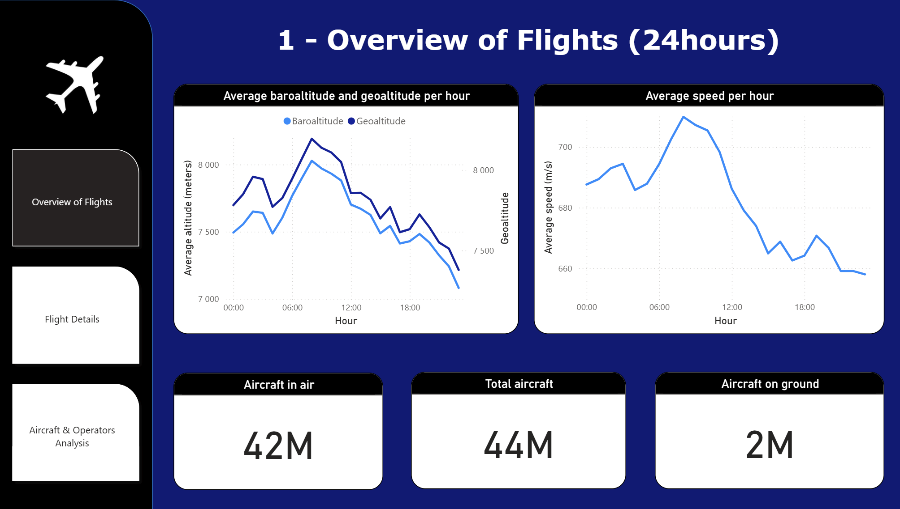
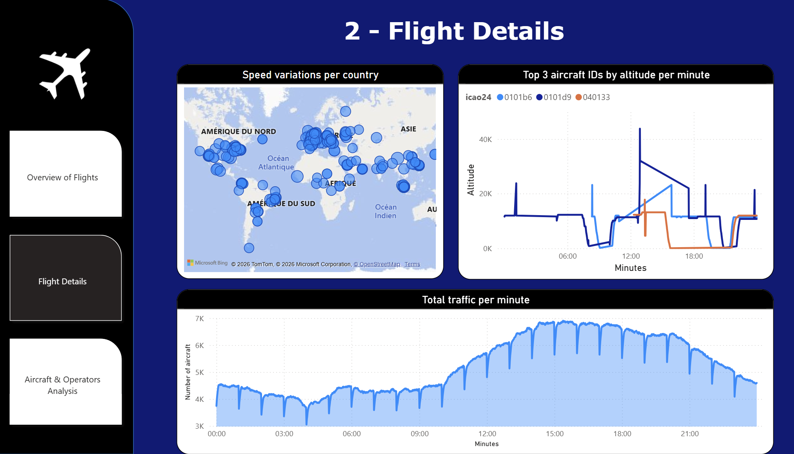
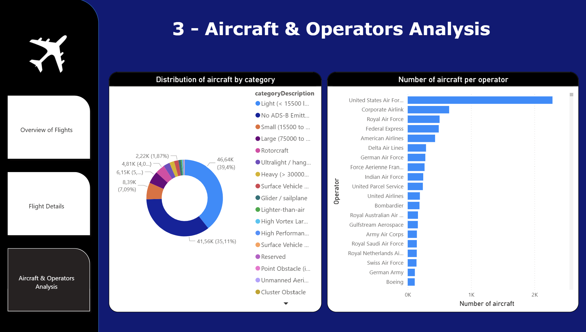

# ✈️ Air Traffic Analysis – Personal Project

## 🔍 Overview

This repository contains my personal data project focused on analyzing **air traffic data from the OpenSky Network**. The goal was to build an end-to-end data pipeline transforming raw flight state vectors into structured, analysis-ready datasets and to visualize insights using Power BI.

Key components:
- **Databricks (Delta Lake)** for data ingestion and storage  
- **dbt (Databricks)** for data transformation  
- **SQL / Python** for data processing  
- **Power BI** for reporting and visualization  

---

## 🚀 How to Run This Project

### If you just want to visualize Power BI dashboards:
Open the `.pbix` file using Power BI Desktop.

---

### If you want to run it from scratch:

#### 1. Upload Raw Data
Upload OpenSky CSV files (`states_*`) into a Databricks Volume: 
/Volumes/personal_project/air_traffic_data/air_traffic_data/

---

#### 2. Load Data into Delta Table
Run a Databricks notebook to load CSV files into a Delta table:

```python
df = spark.read.csv("/Volumes/personal_project/air_traffic_data/air_traffic_data/states_*.csv",
                    header=True,
                    inferSchema=True)

df.write.format("delta").mode("overwrite").saveAsTable("personal_project.air_traffic_data.flights_raw")
```

---

#### 3. Configure dbt
Set up your Databricks connection in profiles.yml
Ensure your target schema is air_traffic_data

--- 

#### 4. Run dbt Models
dbt run --full-refresh
dbt test

This will create:

- stg_flights
- int_flights
- mart_flight_summary
- mart_flight_details

--- 

~ Approach & Key Decisions ~

✅ Tooling Choices

- Databricks + Delta Lake: Chosen for scalable data processing and handling large CSV datasets.
- dbt: Used to structure transformations and apply a modular, layered approach.
- Power BI: Used for building interactive dashboards and visual insights.

🧱 Data Modeling

The raw OpenSky data consists of large CSV files containing aircraft state vectors (position, speed, altitude, etc.).

To structure the data, I applied a layered approach inspired by analytics engineering best practices:

🧪 Staging Layer

The stg_flights model:

- Cleans raw data
- Renames columns
- Joins aircraft reference data (aircraft_ref)

🧰 Intermediate Model

The int_flights model:

- Converts speed from m/s to km/h
- Creates derived fields:
    - is_airborne
    - status (Air / Ground)
- Adds time granularity:
    - hour
    - minute

⭐ Data Marts

mart_flight_summary
- Aggregated at hour level
- KPIs:
    - Total flights
    - Flights in air vs on ground
    - Average speed and altitude

mart_flight_details
- Aggregated at minute + aircraft level
- Includes:
    - Aircraft metadata (operator, model, category)
    - Averaged metrics (speed, altitude, position)
    - Optimized for Power BI visualizations (reduced data volume)

📏 Tests & Data Quality

Basic dbt tests were implemented:

- not_null on key fields (e.g., icao24, minute)
- Ensures reliability of downstream visualizations

📊 Power BI Dashboard

Power BI was used in import mode to build interactive dashboards.

Data Model
- mart_flight_summary → aggregated KPIs
- mart_flight_details → detailed analysis
- aircraft_ref → aircraft metadata

Key Insights & Visuals

1. Flight Overview
- Total number of flights
- Flights in air vs on ground
- Evolution of traffic during the day (average speed and altitude)



2. Flight Details
- Map of the speed variation per country
- Top 3 aircraft ID
- Traffic per minute



3. Aircraft & Operators Analysis
- Aircraft categories
- Number of aircraft per operator



